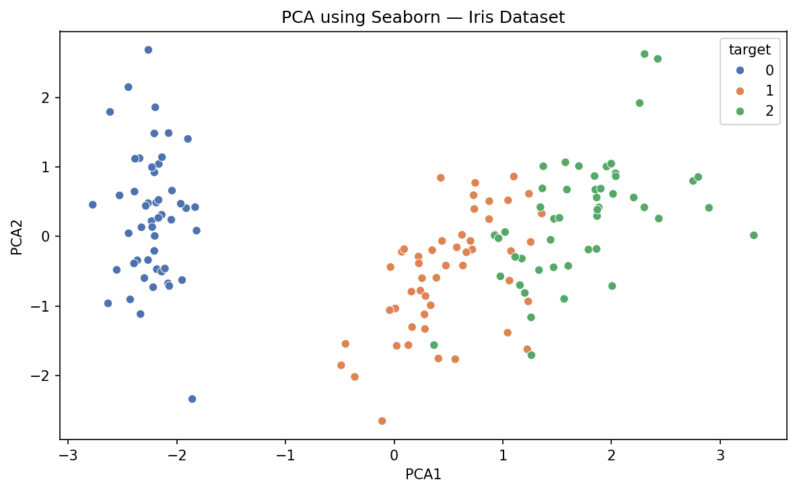

# PCA Mini Project — Iris Dataset

A focused implementation of **Principal Component Analysis (PCA)** on the classic Iris dataset using Python and scikit-learn.

## What this project does

Loads the Iris dataset (150 samples, 4 features), applies PCA to reduce it from 4 dimensions down to 2, and visualizes the result as a 2D scatter plot — showing how well the 3 flower classes separate in the reduced space.

## Results

| Component | Variance Explained |
|-----------|-------------------|
| PC1       | 72.96%            |
| PC2       | 22.85%            |
| **Total** | **95.81%**        |

95.8% of the original information is preserved using just 2 components instead of 4.

## Output



- **Setosa** separates completely from the other two classes
- **Versicolor** and **Virginica** show slight overlap — expected, as they are biologically similar

## Tech Stack

- Python 3.x
- scikit-learn
- pandas
- matplotlib
- seaborn

## How to run

```bash
pip install scikit-learn pandas matplotlib seaborn
python iris_pca.py
```

## Key concepts used

- `StandardScaler` — normalizes features before PCA (critical when features have different scales)
- `PCA(n_components=2)` — reduces 4D data to 2D
- `explained_variance_ratio_` — tells you how much information each component holds

## Dataset

Built-in sklearn dataset — no download needed. 150 samples across 3 iris species (setosa, versicolor, virginica), with 4 features: sepal length, sepal width, petal length, petal width.
